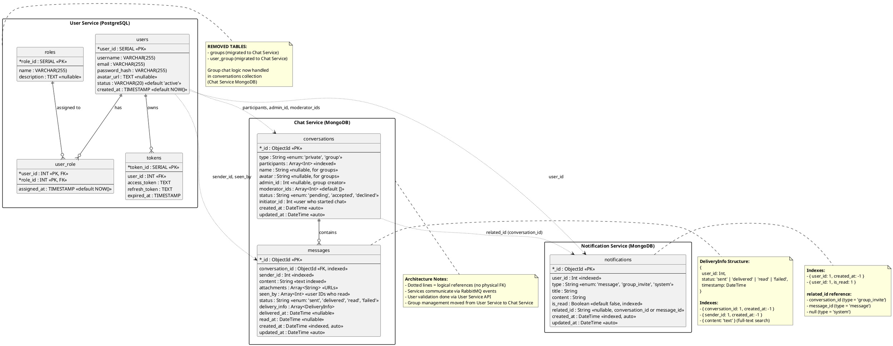

```plantuml
@startuml
' ==========================
' REAL-TIME CHAT APPLICATION (MICROSERVICE ERD)
' Updated: December 2025
' ==========================

skinparam packageStyle rectangle
skinparam classAttributeIconSize 0
hide circle

' ==========================
' USER SERVICE - PostgreSQL
' ==========================
package "User Service (PostgreSQL)" as UserService {
  entity "users" as users {
    * user_id : SERIAL <<PK>>
    --
    username : VARCHAR(255)
    email : VARCHAR(255)
    password_hash : VARCHAR(255)
    avatar_url : TEXT <<nullable>>
    status : VARCHAR(20) <<default 'active'>>
    created_at : TIMESTAMP <<default NOW()>>
  }

  entity "roles" as roles {
    * role_id : SERIAL <<PK>>
    --
    name : VARCHAR(255)
    description : TEXT <<nullable>>
  }

  entity "user_role" as user_role {
    * user_id : INT <<PK, FK>>
    * role_id : INT <<PK, FK>>
    --
    assigned_at : TIMESTAMP <<default NOW()>>
  }

  entity "tokens" as tokens {
    * token_id : SERIAL <<PK>>
    --
    user_id : INT <<FK>>
    access_token : TEXT
    refresh_token : TEXT
    expired_at : TIMESTAMP
  }

  ' === RELATIONSHIPS ===
  users ||--o{ tokens : "owns"
  users ||--o{ user_role : "has"
  roles ||--o{ user_role : "assigned to"
}

note right of UserService
  **REMOVED TABLES:**
  - groups (migrated to Chat Service)
  - user_group (migrated to Chat Service)
  
  Group chat logic now handled
  in conversations collection
  (Chat Service MongoDB)
end note

' ==========================
' CHAT SERVICE - MongoDB
' ==========================
package "Chat Service (MongoDB)" as ChatService {
  entity "conversations" as conversations {
    * _id : ObjectId <<PK>>
    --
    type : String <<enum: 'private', 'group'>>
    participants : Array<Int> <<indexed>>
    ' Group chat metadata
    name : String <<nullable, for groups>>
    avatar : String <<nullable, for groups>>
    admin_id : Int <<nullable, group creator>>
    moderator_ids : Array<Int> <<default []>>
    ' Message request fields
    status : String <<enum: 'pending', 'accepted', 'declined'>>
    initiator_id : Int <<user who started chat>>
    ' Timestamps
    created_at : DateTime <<auto>>
    updated_at : DateTime <<auto>>
  }

  entity "messages" as messages {
    * _id : ObjectId <<PK>>
    --
    conversation_id : ObjectId <<FK, indexed>>
    sender_id : Int <<indexed>>
    content : String <<text indexed>>
    attachments : Array<String> <<URLs>>
    seen_by : Array<Int> <<user IDs who read>>
    ' Message status tracking
    status : String <<enum: 'sent', 'delivered', 'read', 'failed'>>
    delivery_info : Array<DeliveryInfo>
    delivered_at : DateTime <<nullable>>
    read_at : DateTime <<nullable>>
    ' Timestamps
    created_at : DateTime <<indexed, auto>>
    updated_at : DateTime <<auto>>
  }

  conversations ||--o{ messages : "contains"
}

note right of ChatService.messages
  **DeliveryInfo Structure:**
  {
    user_id: Int,
    status: 'sent' | 'delivered' | 'read' | 'failed',
    timestamp: DateTime
  }
  
  **Indexes:**
  - { conversation_id: 1, created_at: -1 }
  - { sender_id: 1, created_at: -1 }
  - { content: 'text' } (full-text search)
end note

' ==========================
' NOTIFICATION SERVICE - MongoDB
' ==========================
package "Notification Service (MongoDB)" as NotifyService {
  entity "notifications" as notifications {
    * _id : ObjectId <<PK>>
    --
    user_id : Int <<indexed>>
    type : String <<enum: 'message', 'group_invite', 'system'>>
    title : String
    content : String
    is_read : Boolean <<default false, indexed>>
    related_id : String <<nullable, conversation_id or message_id>>
    ' Timestamps
    created_at : DateTime <<indexed, auto>>
    updated_at : DateTime <<auto>>
  }
}

note right of NotifyService.notifications
  **Indexes:**
  - { user_id: 1, created_at: -1 }
  - { user_id: 1, is_read: 1 }
  
  **related_id reference:**
  - conversation_id (type = 'group_invite')
  - message_id (type = 'message')
  - null (type = 'system')
end note

' ==========================
' CROSS-SERVICE RELATIONSHIPS (LOGIC ONLY)
' ==========================
UserService.users -[dotted]-> ChatService.conversations : "participants, admin_id, moderator_ids"
UserService.users -[dotted]-> ChatService.messages : "sender_id, seen_by"
ChatService.conversations -[dotted]-> NotifyService.notifications : "related_id (conversation_id)"
UserService.users -[dotted]-> NotifyService.notifications : "user_id"

note bottom of ChatService
  **Architecture Notes:**
  - Dotted lines = logical references (no physical FK)
  - Services communicate via RabbitMQ events
  - User validation done via User Service API
  - Group management moved from User Service to Chat Service
end note

@enduml


```